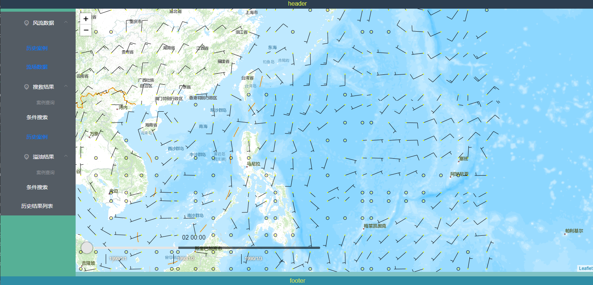
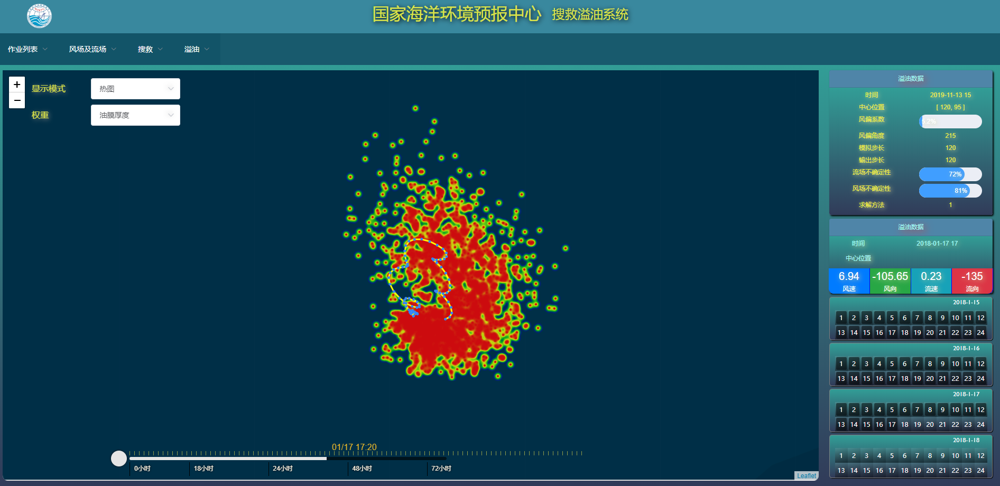

# SearchRescueSys
搜救溢油系统 
2019-08-23 效果如下：

2019-11-13 `溢油`效果如下：
1. 热力图版
  
2. 散点图版
  

---
[进度详见](./SCHEDULE.MD)

---
后端工程的介绍:
[后端工程](./background/README.md)
* [x] 20-04-04 + [自动化服务发布的定时任务](background/06byDelayTask/proj/README.md)
