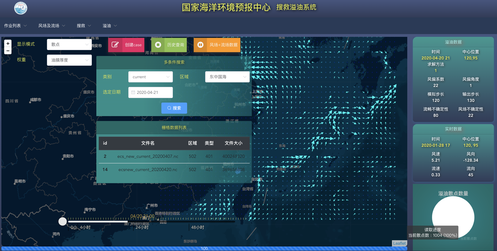

# SearchRescueSys
## 大体效果

搜救溢油系统 
2019-08-23 效果如下：


2019-11-13 `溢油`效果如下：
1. 热力图版
      

2. 散点图版
      

  20-04-20 效果如下:

  

---
## 进度

[进度详见](./SCHEDULE.MD)

---
## 工程结构及说明


后端工程的介绍:
[后端工程](./background/README.md)

* [x] 20-04-04 + [自动化服务发布的定时任务](background/06byDelayTask/proj/README.md)

---

### web server目录结构:

```
|__ Search_Rescue
	|__ base/
		|__ common.py
		|__ enmu.py			所有枚举
	|__ common/
	|__ geo/
	|__ oilspiling/				溢油app
	|__ rescue/						搜救app
	|__ tasks/						防止需要通过celery调用的代码块
		|__ celery_con.py		用来创建Celery并设置
		|__ settings.py			celery相关配置
		|__ tasks.py				任务task
	|__ users/
	|__ util/
	mainage.py
```

### 使用celery分布式作业调度模块


使用 **Celery** 作为分布式作业调度模块

其中 Celery 的主要程序放在 webserver 目录下 tasks/

目录结构如下

```
|__ Search_Rescue
	|__ tasks/						防止需要通过celery调用的代码块
		|__ celery_con.py		用来创建Celery并设置
		|__ settings.py			celery相关配置
		|__ tasks.py				任务task
```

启动Celery,在 webserver根目录下

```shell
celery -A tasks.tasks worker -l info
```

可以通过 

```
rabbitmqctl status
```

查看，注意 **amqp** 的端口是 **5672**

目前准备将所有的task放在 `tasks/` 下集中管理

之前的溢油相关的任务在 `Search_Rescue/oilspilling/tasks/` 目录下
所有的app对应的tasks均放在对应的app下的 `tasks.py` 中
eg:
```
|__ Search_Rescue
	|__ oilspilling/		
	   |__ views.py		      
		|__ tasks.py				oil对应的任务task
```
* [ ] 20-04-23 pm:若采用上面的方式，将tasks写在对应的app下，会存在无法触发异步任务的问题

现将调用 `opendrift` 的task代码准备放在 `/Search_Rescue/base/` 目录下 命名为 `task_base.py`

### 采用面向切面的方式实现对于job的支持化操作

当前的调用规则

```
|__ Search_Rescue
	|__ base/
		|__ common.py
		|__ enmu.py			所有枚举
		|__ tasks_base.py		所有 taks的父类
			|__ TaskOpenDrift
				|__ job					执行调用opendrift的方法
	|__ common/
	|__ oilspiling/				溢油app
		|__ tasks.py				溢油的相关的任务
			|__ do_job				外部直接调用do_job 方法，加入了celery
			|__ XXXJob				do_job 在循环调用 XXXJob 方法，其中OilPyJob中调用了 TaskOpenDrift.job 方法
	|__ tasks/						防止需要通过celery调用的代码块
		|__ celery_con.py		用来创建Celery并设置
		|__ settings.py			celery相关配置
		|__ tasks.py				任务task
	|__ users/
		|__ views_base.py
			|__ CaseBaseview
				|__ __do_job		调用 -> oilspilling/tasks.py -> OilPyJob -> TaskopenDrift.job 方法
				|__ set_jobinfo 调用 -> self.__do_job ,并创建 JobInfo(对应user_jobinfo)
		|__ views.py -> CaseModelView.post 调用-> CaseBaseView.set_jobinfo
			|__ 
	|__ util/
	mainage.py
```

将 users/views_base.py 中的CaseBaseView.set_jobinfo 的create jobinfo 操作修改为装饰器的形式

### 规约
