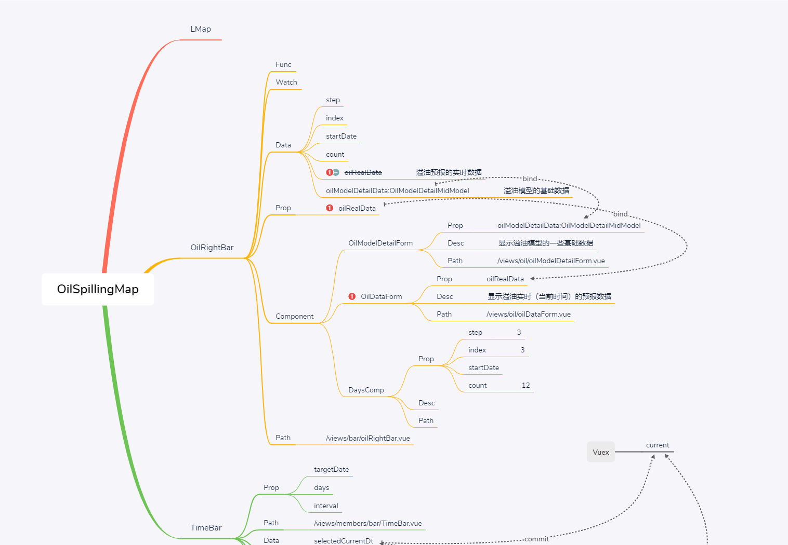

---
19-08-21
- [x] 1.修改了前台使用 vue2-leaflet 组件时，更新 url 而未刷新的问题
- [x] 2.改为将 wms-tile-layer 依托数组的方式
---

19-08-22

- [x] 1.由 timebar 像 windMap 的传递
- [ ] 2.  加入 timebar 的设计，未完成，晚上继续

---

19-08-23

- [x] 1. timebar 由 data 中的 datalist 来动态生成长度
- [x] 2. 完成 timebar 的功能
- [ ] 3. 部分遇见的问题待总结

---

19-09-03

- [x] 1. 完成对搜救 nc 文件的录入操作
- [ ] 2. 前端展示

---

19-09-17

- [ ] 1. 读取溢油数据
- [ ] 2. 设计mongo中相关库表

---
之后进度部分未更新

---
19-10-31
- [x] 前端完成点击`OilSpillingMap`更新`oilAvgRealData`并prop的方式传递给子组件
- [x] 后端加入相应接口
- [x] 组件设计如下
   
   

---
19-11-07 
- [x] 前端完成`src\views\content\oilspilling\oilSpillingMap.vue`与`src\views\bar\oilRightBar.vue`组件的联动，修改了之前存在的部分bug

---
19-11-13
- [x] 溢油完成了load时清除 heat与散点图
- [x] 样式统一修改 