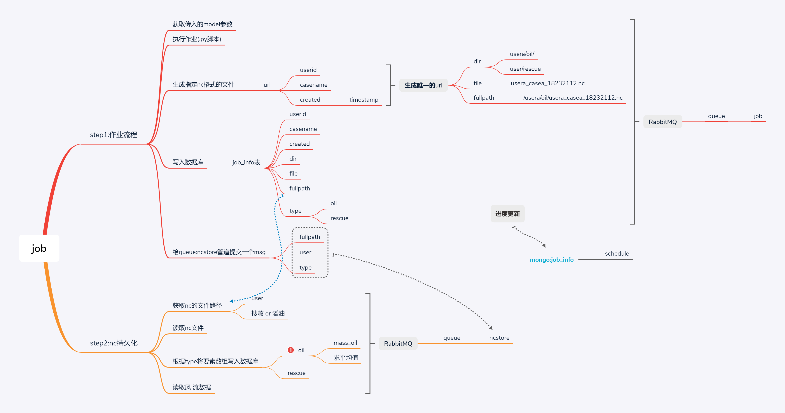
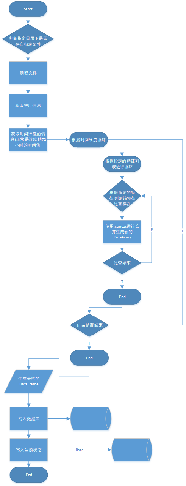

后台的目录结构如下
<pre><code>
├──./                            
├──01 byJupyter  
├──02 rescue                       <= 读取nc文件并写入mongo的proj
├──03 messagehandle                <= 使用rabbitmq实现的分布式消息队(原型) by zw
├──04 byRabbitmq                   <= 最终的消息队列的实现版
</code></pre>

---

[rabbitmq 安装可以参考](https://github.com/RandolphChin/RandolphChin.github.io/issues/203)

# 1 作业设计 job
## 1.1 job info  
job info主要为后端接收到前端提交的(eg:溢油的model信息以及其他信息),由`django`接收到请求后，直接通过`rabbitmq`的`生产者`提交给`消息队列`，延迟的操作交给后台的消费者来处理
  
job主要包括几个步骤：
+ 获取提交的溢油model的相关参数
+ 生成一个nc的url地址 
> eg:   userId:xxx123
        case:xxx_a
        created:一个timestap
        =>
        xxx123_xxx_a_timestap
  
+ 写入db

# 2 background 工程结构设计
## 2.2
- [x]  19-12-26 
 现将目录结构改为：     
 <pre><code>
├──./                            
├──04 byRabbitmq
│ ├── conf                 <- 配置文件目录
│ │ ├──setting.py
│ ├── core                 <- 核心文件目录
│ │ ├──job.py              <- 部分核心装饰器|Job的状态（3种）|作业的基础父类JobBase,继承自JobBase的供其他实现job的父类——其中定义了do_job抽象方法，需要由子类实现
│ │ ├──store.py
│ │ ├──data.py             <- 所有直接和mongodb交互的类与方法
│ ├── job                  <- 所有的job的实现子类目录(现有:oil|rescue...)
│ │ ├──oil.py
│ │ ├──step.py             <- 读取指定预报产品的nc文件的相关业务操作(执行都是通过调用 do_job 的方式进行操作)     
│ ├── model
│ ├── models
│ ├── msg                  <- 在job中的各个方法直接通用的传递消息的参数为request，放在此目录下
│ ├── script               <- 所有的执行各模型的脚本放置此目录下
│ ├── main.py               <- 入口文件
</code></pre>

重新梳理后的工作流如下图：
  
